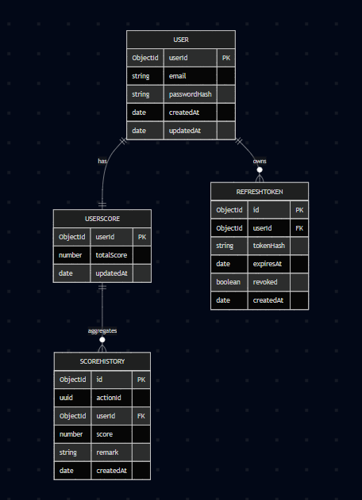
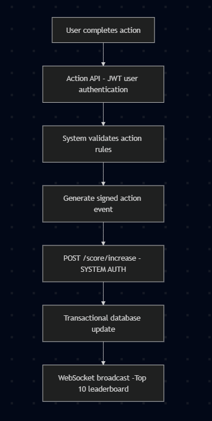

# Live Score Board System — Specification Document

## 1. Overview

This project implements a **real-time Top 10 scoreboard system** with **strong anti-cheat protection**.

Key design principle:

> **Users authenticate actions.  
> Only the SYSTEM authorizes score increases.**

The system prevents malicious users from abusing APIs even if they possess valid access tokens.

## 2. Core Features

### Functional Requirements
- Display Top 10 users’ scores
- Live updates when scores change
- Users perform actions that may result in score increases
- Score updates are triggered **only by system-verified events**
- Full audit trail of score changes

### Non-Functional Requirements
- Zero trust in client-side score updates
- Transaction-safe score calculation
- Real-time broadcasting
- Horizontally scalable design

## 3. High-Level Architecture
```text
Client (Web / App)
│
│ 1. User performs action
▼
Action API (Authenticated)
│
│ 2. Server validates action rules
▼
Internal System Event
│
│ 3. System-only authorization
▼
Score Board Service
│
│ 4. Transactional update
▼
WebSocket Broadcast (Top 10)
```
**Clients NEVER call score update APIs directly**
## Entities Overview

## 4. Security Model

### User Access Tokens Are Not Enough

Even with JWT authentication, users can:
- Replay requests
- Automate API calls
- Inflate scores legitimately but unfairly

### Security Strategy

| Layer | Protection |
|----|----|
Authentication | JWT (user identity only) |
Authorization | System-only score endpoints |
Integrity | Signed action tokens |
Replay protection | Idempotency keys |
Abuse prevention | Rate limiting |
Audit | Score history table |

## 5. Source Code Structure

```text
src/
├── configs/
│   ├── cors.config.ts
│   ├── env.config.ts
│   └── mongodb.config.ts
│
├── exceptions/
│   ├── http.exception.ts
│   └── global-exception.filter.ts
│
├── middlewares/
│   ├── auth.middleware.ts
│   ├── system-auth.middleware.ts
│   ├── validation.middleware.ts
│   ├── logger.middleware.ts
│   └── response.middleware.ts
│
├── routes/
│   └── index.ts
│
├── shared/
│   ├── base.repository.ts
│   ├── constants.ts
│   ├── crypto.util.ts
│   └── utils.ts
│
├── modules/
│   ├── auth/
│   │   ├── dtos/
│   │   │   ├── login.dto.ts
│   │   │   ├── register.dto.ts
│   │   │   └── refresh-token.dto.ts
│   │   ├── entities/
│   │   │   └── refresh-token.entity.ts
│   │   ├── strategies/
│   │   │   ├── jwtLocal.strategy.ts
│   │   │   └── jwt.strategy.ts
│   │   ├── auth.controller.ts
│   │   ├── auth.service.ts
│   │   └── auth.router.ts
│   │
│   ├── user/
│   │   ├── dtos/
│   │   │   ├── create-user.dto.ts
│   │   │   └── update-user.dto.ts
│   │   ├── entities/
│   │   │   └── user.entity.ts
│   │   ├── user.service.ts
│   │   ├── user.repository.ts
│   │   └── user.router.ts
│   │
│   └── score-board/
│       ├── dtos/
│       │   ├── action-event.dto.ts
│       │   └── system-score.dto.ts
│       ├── entities/
│       │   ├── user-score.entity.ts
│       │   └── score-history.entity.ts
│       ├── score-board.controller.ts
│       ├── score-board.service.ts
│       ├── score-board.repository.ts
│       └── score-board.router.ts
```
## 6. Module Specifications

### 6.1 Auth Module

**Responsibility**
- Authenticate users and issue JWT tokens
- Provide user identity only (not score authorization)

**Endpoints**
- `POST /auth/register`
- `POST /auth/login`
- `POST /auth/refresh-token`

**Strategies**
- `jwtLocalStrategy` – Validate login credentials
- `jwtStrategy` – Verify user access tokens

---

### 6.2 User Module

**Responsibility**
- Manage user profile information
- Serve as the base entity for score tracking


### 6.3 Score Board Module (System-Controlled)

**Core Rule**
> Users must never directly increase scores.  
> All score updates are authorized and executed by the system only.

#### Controller (`score-board.controller.ts`)

##### Public WebSocket (Read-Only)
- `GET /score-board/ws`
- Broadcasts real-time Top 10 leaderboard updates

##### Internal System Endpoint
```http
POST /internal/score/increase
Authorization: Bearer SYSTEM_TOKEN
```
Payload:
```json
{
  "actionId": "uuid",
  "userId": "string",
  "score": 10,
  "remark": "Completed task"
}
```

### Service (`score-board.service.ts`)

#### Leaderboard Broadcasting
- Fetch Top 10 users ordered by `totalScore`
- Emit real-time leaderboard updates via WebSocket to all connected clients

#### Transactional Score Update
- Validate system signature to ensure request authenticity
- Ensure `actionId` uniqueness to prevent replay attacks
- Start database transaction:
  - Insert a new record into `scoreHistory`
  - Recalculate the user’s total score
  - Update the corresponding record in `userScore`
- Commit the transaction
- Broadcast the updated Top 10 leaderboard via WebSocket

---

### Repository (`score-board.repository.ts`)

Provides an abstraction layer for all database operations related to the scoreboard:

- `getTop10Users()` – Retrieve the Top 10 users by total score
- `insertScoreHistory()` – Persist a new score history record
- `updateUserScore()` – Update the user’s aggregated score
- `isActionProcessed(actionId)` – Check if an action has already been processed (idempotency)

## 7. Secure Score Update Flow


## 8. Error Handling & Abuse Prevention

### Error Handling

| HTTP Code | Description |
|----------|-------------|
| 400 | Invalid request or validation error |
| 401 | Unauthorized |
| 403 | Forbidden |
| 409 | Duplicate action detected |
| 500 | Internal server error |

- Centralized exception handling
- DTO-based request validation
- Consistent and structured API error responses

### Abuse Prevention

- Idempotency enforcement using `actionId`
- System-only authorization for score update endpoints
- Rate limiting on action processing
- Score boundary and sanity validation
- Logging, monitoring, and anomaly detection

# Future Enhancements

- Redis caching for Top 10 leaderboard performance optimization
- Event-driven scoring using Kafka / RabbitMQ / SQS
- Advanced cheat-detection heuristics
- Seasonal or time-based leaderboard resets
- Admin monitoring and moderation dashboard

### API Gateway & Backend Isolation (Security Enhancement)

- Introduce an **API Gateway** as the single public entry point for all client requests
- Handle **authentication and authorization at the API Gateway level**
  - Validate user JWTs
  - Enforce rate limiting and request quotas
  - Apply WAF and DDoS protection rules
- Deploy backend services (Score Board, User, Auth, Action Processing) in a **private network**
  - Backend servers are **not exposed to the public internet**
  - No public IP assigned to backend services
- Only allow traffic from the API Gateway to backend services
  - Use internal networking, security groups, or service mesh policies
- Implement **system-to-system authentication** between API Gateway and backend services
  - mTLS or signed system tokens
- Create a dedicated **Authentication Service**
  - Responsible only for issuing and validating tokens
  - Backend services trust authentication headers injected by the API Gateway

**Benefits**
- Reduced attack surface
- Centralized security enforcement
- Easier scaling and monitoring
- Clear separation of concerns between edge security and core business logic
---

## Scalability & High-Traffic Readiness (3M+ Users)

### Objective

To support **millions of concurrent users (3M+)**, the system is designed to **scale horizontally**, distribute load efficiently, and remain observable under heavy traffic.

This section outlines how the architecture can be enhanced to handle **high throughput and peak concurrency**.

---

## Load Balancing Strategy

### Entry Layer (Traffic Distribution)

- Use a **managed load balancer** as the single public entry point:
  - AWS Application Load Balancer (ALB)

**Responsibilities**
- Distribute incoming HTTP and WebSocket traffic
- Health checks for backend services
- TLS termination
- Request routing by path or service

## Horizontal Scaling

### Stateless Services

All backend services are designed to be **stateless**, enabling:
- Horizontal scaling via replicas
- Safe traffic distribution
- Zero session affinity dependency

### Scaling Mechanisms

| Platform | Scaling Method |
|--------|----------------|
AWS ECS | Auto Scaling Groups (CPU / memory / request count) |
Kubernetes | Horizontal Pod Autoscaler (HPA) |
API Gateway | Managed auto-scaling |

---

## WebSocket Scaling (Real-Time Traffic)

To support millions of real-time connections:

- Use a **shared message broker**:
  - Redis Pub/Sub
  - Kafka
- Each WebSocket instance:
  - Subscribes to score update events
  - Broadcasts to connected clients

## Database Scalability

### Read & Write Optimization

- Use **read-optimized indexes** for leaderboard queries
- Separate:
  - Write-heavy paths (score updates)
  - Read-heavy paths (leaderboard display)

### NoSQL Strategy (DynamoDB)

- Partition by `userId`
- Enable on-demand capacity or auto-scaling
- Use Global Secondary Index (GSI) for leaderboard access patterns

---

## Caching Layer

Introduce caching to reduce database pressure:

- Redis / ElastiCache
- Cache Top 10 leaderboard with short TTL (e.g. 1–5 seconds)
- Cache invalidation triggered by score updates

---

## Monitoring & Observability

### Metrics

Track:
- Request rate (RPS)
- Error rate
- Latency (P50 / P95 / P99)
- WebSocket connections count
- Score update throughput

### Tools

| Area | Tool |
|----|----|
Metrics | Prometheus / CloudWatch |
Logging | ELK / CloudWatch Logs |
Tracing | OpenTelemetry / AWS X-Ray |
Alerts | Alertmanager / CloudWatch Alarms |

---

## Fault Tolerance & Resilience

- Health checks at load balancer level
- Circuit breakers for downstream services
- Graceful degradation for non-critical features
- Automatic instance replacement on failure

---

## Capacity Planning (Example)

| Component | Strategy |
|--------|---------|
API Gateway | Auto-scale |
Backend Services | Scale replicas horizontally |
WebSocket | Shard connections across instances |
Database | On-demand / auto-scaling |
Cache | Cluster mode |

---

## Summary

By applying:
- Load balancing
- Stateless service design
- Horizontal auto-scaling
- Caching
- Centralized monitoring

The system can **safely handle 3M+ users**, absorb traffic spikes, and scale dynamically while maintaining reliability and performance.

---
### Containerization with Docker & Docker Compose

#### Purpose
- Standardize development and deployment environments
- Enable local development with production-like setup
- Simplify service orchestration and dependency management

#### Docker Usage

Each service is containerized independently:

- API Gateway
- Auth Service
- User Service
- Score Board Service
- WebSocket Service

Benefits:
- One-command startup (docker-compose up)
- Consistent environments across teams
- Isolated internal services
- Easy CI/CD integration
